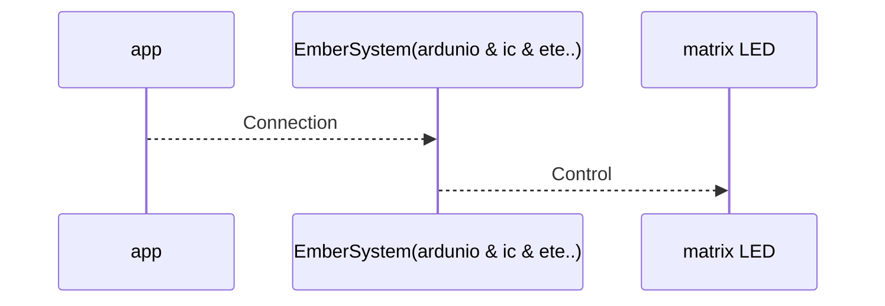

# Mục tiêu chính: Thực hiện các chức năng trên app để tương tác với các matrix LED

Vậy app có những chức năng gì, matrix LED là gì, trông như nào?

App có những chức năng:
1. Dịch phải các kí tự
2. Dịch trái các kí tự
3. Nhấp nháy các kí tự
4. Làm toán cơ bản (+-*/)
5. ...
   
Matrix LED là gì?

Matrix LED là tập hợp các đèn LED xếp theo chiều dài và chiều rộng tạo thành ma trận LED, với các chân LED cùng cực được nối tiếp nhau.

Matrix LED trông như nào ?

và đây là "Sơ đồ matrix LED"

Ờm thì, vậy bằng cách nào để các chức năng của app mà điều khiển được các matrix LED 1 cách thần kỳ vậy :D ?

Để từ app chạy ra matrix LED thì cần quãng đường sau:

Vậy chúng hoạt động với nhau như thế nào?

chúng ta sẽ lựa chọn chức năng trong app, thêm tham số(nếu có), rồi bấm chạy. App sẽ truyền chức năng cần thực hiện thông qua kết nối không dây tới EmberSystem(ardunio & ic & ete..). EmberSystem(ardunio & ic & ete..) nhận được sẽ gọi hàm tương ứng với chức năng người dùng yêu cầu, thể hiện kết quả thông qua matrix LED

